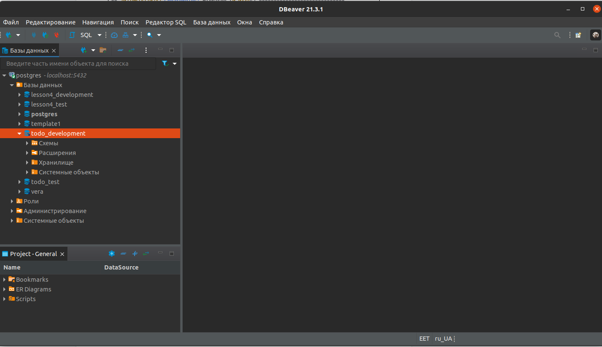

# Урок 5

1. Созданы страницы Главная / О нас / Помощь
2. Добавлено меню навигации
3. Немного поигралась с разметкой (предварительный вариант, в дальнейшем может изменится до неузнаваемости)
4. Сесиями и **.yml** файлами пока не занималась
5. Стили пока также подключены исключительно с целью приблизительно поразмечать, что где будет
6. Бутстрап пока не подключала (В дальнейшем подключать буду его +  применять собственные стили)
7. Файлы стилей изменила на **.scss** (у него больше возможностей)
***
# Урок 6
1. 
2. Созданы модели Items, Events, Users, Roles. Но пока без внешних ключей (так как, по задумке, приложение будет чуть более сложное в плане связей). Созданы валидации для моделей Items, Events, Roles и добавлена валидация формата емейла в модель Users.
3. Cозданы rake задачи для заполнения каждой из задач. 